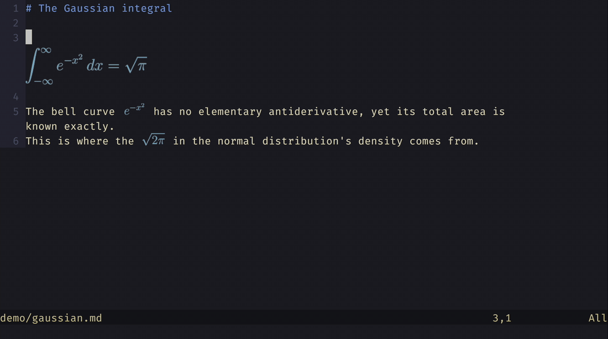

# butwhy.nvim


Highlight a passage in Neovim, such as a line of code, a paragraph or a LaTeX equation, and get it
explained at your level in a small pop-up right under it. Still unclear? Ask "but why?" and it
re-explains one level simpler, as many times as you like. The highlight is the topic; about 40
lines on either side are sent as context only, so the answer stays on what you selected.



Answers write maths as LaTeX. Neovim shows it as source unless something renders it; above, it
is typeset by [snacks.nvim](https://github.com/folke/snacks.nvim), a plugin that draws images in
terminals that support them. See [LaTeX rendering](#latex-rendering), or set `math = 'plain'` for
Unicode maths that reads well anywhere.

butwhy is built on [CodeCompanion.nvim](https://github.com/olimorris/codecompanion.nvim), a
Neovim plugin that connects chat buffers to large language model (LLM) providers, so it works
with any model CodeCompanion supports.

**Status:** early. Explaining a highlight, drilling down to simpler levels, and asking your own
questions about a highlight work. Planned next: web search for further reading.

## Requirements

- Neovim 0.12 and CodeCompanion v19 (tested with 0.12.4 and v19.22)
- An API key for the model you choose, or a local model server

## Install

With the built-in `vim.pack`:

```lua
vim.pack.add {
  'https://github.com/nvim-lua/plenary.nvim',
  'https://github.com/olimorris/codecompanion.nvim',
  'https://github.com/aaholmes/butwhy.nvim',
}
require('codecompanion').setup {}
require('butwhy').setup()
```

Any plugin manager works, as long as `butwhy.setup()` runs after CodeCompanion's setup.

The default model, GPT-6 Luna, needs an OpenAI API key in `OPENAI_API_KEY`. Without one, use the
free option instead: create a key at ollama.com, set `OLLAMA_API_KEY`, and call
`require('butwhy').setup { adapter = 'ollama_cloud' }`. See [Choose a model](#choose-a-model).

## Tell it who you are

Write a short background file at `~/.config/butwhy/background.md`. It is attached to every
butwhy chat (and only those), so explanations start at your level. Specific topics work better
than job titles:

```markdown
# Reader background

## Strong
- Linear algebra, probability
- Python, NumPy, PyTorch

## Partial
- C++ (can read it; templates are shaky)

## Not familiar
- Compilers, measure-theoretic probability

## Preferences
- Use a concrete numeric or code example whenever possible.
- Define every acronym on first use.
```

Keep it under about 40 lines: it is sent with every request, and small local models start
ignoring parts of long instructions.

## Use

Select text in visual mode and press `<leader>we` (or run `:'<,'>ButwhyExplain`). A pop-up
opens directly under the selection (or above it, near the bottom of the window), the selected
text stays highlighted until the pop-up closes, and the pop-up shows only the answer: a few sentences on what the highlight is and what it does in this
particular file. The prompt and your background are sent to the model but not shown.

Still confused? Press `<leader>ws` in the pop-up (or run `:ButwhySimpler`) to have it re-explained
one level simpler: less jargon, every term the previous answer relied on defined, and a simpler
example. Press it again to keep going; the title shows the level, and the pop-up shows only the
latest answer.

To ask something specific instead, select text and press `<leader>wa` (or run
`:'<,'>ButwhyAsk`). The pop-up opens in Insert mode; type your question and send it with
CodeCompanion's send key (`<C-s>` in Insert mode, `<CR>` in Normal mode, by default). The
highlight and its surroundings are sent along with the question but not shown.

Either pop-up is an ordinary CodeCompanion chat, so you can keep typing follow-up questions at
the bottom. The model answering is shown in the pop-up's bottom border. Press `q` or `<Esc>` in
Normal mode to close it (in butwhy pop-ups these replace CodeCompanion's `q`, which stops an
answer mid-stream).

### LaTeX rendering

butwhy only asks for LaTeX; drawing it is up to your setup. The GIF above uses:

- a terminal that can show images through kitty's graphics protocol (kitty, Ghostty or WezTerm);
  inside tmux, set `allow-passthrough on`
- snacks.nvim with its image module enabled, which typesets each `$...$` with pdflatex or
  tectonic and converts it to an image with ImageMagick
- the treesitter `latex`, `markdown` and `markdown_inline` parsers

By default snacks.nvim scales each inline equation to fill a row, so a lone $c$ comes out much
larger than $N(s)$, and it compiles with tectonic before pdflatex. `demo/latex_init.lua` shows
settings that draw all inline equations at one size and prefer pdflatex (about 0.13 s per
equation instead of 0.4 s; its template needs the `standalone`, `preview` and `varwidth` LaTeX
packages).

## Choose a model

The default is GPT-6 Luna from OpenAI with reasoning turned off, the most accurate model in the
comparison below, at about 1.5 seconds per answer and roughly $0.03 per 100 explanations. Set
`OPENAI_API_KEY`; butwhy defines the `openai_luna` adapter for you unless you already have one.
OpenAI's API does not train on your inputs by default, but keeps them for up to 30 days for
abuse monitoring.

butwhy also defines two alternatives, each registered only if you have no adapter of that name:

- `ollama_cloud`: Gemma 4 31B on Ollama Cloud, which has a free plan and states that prompts are
  not logged or used for training. Set `OLLAMA_API_KEY` and pass `adapter = 'ollama_cloud'`.
- `mercury`: Mercury 2.5 from Inception Labs, a diffusion language model (it refines many tokens
  in parallel rather than generating one at a time) and the fastest option tested. Set
  `INCEPTION_API_KEY` and pass `adapter = 'mercury'`. The adapter sets `reasoning_effort` to
  `instant`; at the API's default (`medium`) the first word takes a few seconds to arrive.

To use something else, pass any CodeCompanion adapter:

```lua
require('butwhy').setup { adapter = 'ollama_cloud' } -- a name, using that adapter's default model
require('butwhy').setup { adapter = { name = 'anthropic', model = 'claude-haiku-4-5' } }
require('butwhy').setup { adapter = false }           -- CodeCompanion's configured chat adapter
```

To have a second model answer when a request fails (credit used up, a network error, a bad key),
set `fallback`, in any of the forms `adapter` accepts. The pop-up then stays on the fallback, and
the next pop-up tries the main model first:

```lua
require('butwhy').setup { fallback = 'ollama_cloud' }
```

OpenAI reports exhausted credit as a rate-limit error, which is retried three times before the
fallback is asked, so each explanation takes a few seconds longer until credit is added.

Models on Baseten, Groq, OpenRouter and similar hosts use the OpenAI-compatible format: define an
adapter by extending `openai_compatible` with the host's URL, key variable and model name, as
butwhy's own adapters do in `lua/butwhy/init.lua`. You can also switch adapter inside any open
chat with CodeCompanion's own keymap (press `?` in the chat to list them).

### Recommended models

- **Most accurate (the default):** GPT-6 Luna, with reasoning off.
- **Free:** Gemma 4 31B on Ollama Cloud's free plan. It is also the best candidate for running on
  your own machine, though at 4-bit it needs more than 16 GB of GPU memory.
- **Close second, open weights:** Kimi K3 on Baseten, with reasoning off; it costs about 30 times
  as much per token as Luna.
- **Fastest and cheapest:** Mercury 2.5, at the cost of lower accuracy.

### Model comparison

Each model explained 13 highlights at four levels (the first answer plus three "simpler"
steps): Python, Rust and C code, a GPU kernel, LaTeX equations, a Markdown design note, and two
Wikipedia passages outside the reader's field (property law and immunology). A separate model
graded every answer using a written reference answer, without knowing which model produced it.
All models ran with reasoning off, or at the lowest setting where it cannot be turned off, so
none was spending extra time thinking. Grading was done in three passes; models graded in more
than one pass show the average. Tested September 2026.

| Model (provider) | Answers fully correct (of 52) | First answer correct (of 13) | Steps judged simpler | Median time | Price per 1M tokens (input / output) |
|---|---|---|---|---|---|
| GPT-6 Luna (OpenAI) | 86% | 12 | 79% | 1.6 s | $0.10 / $0.50 |
| Kimi K3 (Baseten) | 77% | 9.7 | 72% | 1.5 s | $3.00 / $15.00 |
| DeepSeek V4 Pro (Baseten) | 67% | 7 | 72% | 1.2 s | $1.32 / $3.96 |
| Gemma 4 31B (Ollama Cloud) | 65% | 8.3 | 81% | 1.0 s | free plan; $0.14 / $0.40 after |
| Muse Glimmer 30B, minimal reasoning (OpenRouter) | 52% | 6 | 44% | 5.5 s | $0.30 / $1.20 |
| Claude Haiku 4.5 (Anthropic) | 50% | 7 | 87% | 2.0 s | $1.00 / $5.00 |
| Gemma 4 26B-A4B (OpenRouter) | 50% | 7 | 31% | 2.1 s | $0.09 / $0.30 |
| Mercury 2.5, `instant` (Inception) | 46% | 5.7 | 56% | 0.9 s | $0.04 / $0.15 (launch price) |
| Nemotron 3 Ultra (Ollama Cloud) | 44% | 3 | 74% | 14 s | free plan |
| Qwen 3.8 27B (Groq) | 42% | 4 | 79% | 0.6 s | free plan |
| Qwen 3.6 35B-A3B (OpenRouter) | 42% | 5 | 54% | 1.1 s | $0.15 / $1.00 |
| gpt-oss-20b, low reasoning (Ollama Cloud) | 40% | 6 | 31% | 3.1 s | free plan |
| Mercury 2.5, `low` (Inception) | 38% | 6 | 52% | 1.2 s | $0.04 / $0.15 (launch price) |
| gpt-oss-120b, low reasoning (Groq) | 29% | 3 | 54% | 1.2 s | free plan |
| Nemotron 3 Nano 30B (Ollama Cloud) | 8% | 2 | 28% | 5.0 s | free plan |

Read the table with its limits in mind. Each model gave one answer per highlight, and 13
highlights is a small set: only gaps of roughly 15 to 30 percentage points, depending on the
pair, are larger than the noise. GPT-6 Luna's lead over Gemma 4 31B held in both grading passes
that included them; its lead over Kimi K3 did not. Models graded in several passes scored
within about 4 percentage points of their own average each time. The grader was itself a
language model. The evaluation set is not published, because several highlights come from
unpublished code; the table is a guide, not a reproducible benchmark. One highlight, a piece of collision-avoidance geometry, was answered wrongly or
imprecisely by nearly every model. Times are for each provider's service on the day, including
queueing on free plans.

## Options

```lua
require('butwhy').setup {
  background = '~/.config/butwhy/background.md',
  adapter = { name = 'openai_luna', model = 'gpt-6-luna' },
  -- Pop-up window; takes any CodeCompanion chat window option, and affects butwhy chats only.
  -- A floating pop-up is resized to fit its text, wrapping at max_width columns.
  window = { layout = 'float', border = 'rounded', title = ' butwhy ' },
  max_width = 80,
  -- How answers write maths: 'latex' ($...$ and $$...$$, for a Neovim setup that renders
  -- LaTeX) or 'plain' (Unicode symbols such as √ and ≥, readable anywhere).
  math = 'latex',
  -- Keys butwhy maps (`simpler` and `close` only inside the pop-up); false, for all or one,
  -- maps nothing. :ButwhyExplain, :ButwhyAsk and :ButwhySimpler work either way.
  keymaps = { explain = '<leader>we', ask = '<leader>wa', simpler = '<leader>ws', close = { 'q', '<Esc>' } },
}
```

The selected text uses the `ButwhyHighlight` group, linked by default to `IncSearch`, the group
Neovim flashes when you yank text. The pop-up's border and title use `ButwhyBorder`, drawn in the
same colour (the highlight's background, where it has one). Set either group in your colour
scheme or with `vim.api.nvim_set_hl(0, 'ButwhyHighlight', { ... })` to change it.

## Tests

Headless checks. The pop-up checks drive a real chat through a mock model server running
inside Neovim, so no API key or network is needed:

```sh
nvim --headless -u tests/minimal_init.lua -c 'luafile tests/butwhy_spec.lua'
nvim --headless -u tests/minimal_init.lua -c 'luafile tests/popup_spec.lua'
nvim --headless -u tests/minimal_init.lua -c 'luafile tests/ask_spec.lua'
```

Dependencies are loaded with `:packadd`; set `BUTWHY_DEPS` to a directory containing
`plenary.nvim` and `codecompanion.nvim` to use other copies.

The first GIF above is recorded with [VHS](https://github.com/charmbracelet/vhs) from
`demo/demo.tape` (`vhs demo/demo.tape` from the repository root, with `OPENAI_API_KEY` set), using
the clean configuration in `demo/init.lua`. VHS cannot show terminal images, so the LaTeX GIF is a
screen recording of kitty: `demo/record_latex.sh` plays the keystrokes using
`demo/latex_init.lua`, and `demo/to_gif.sh` trims and converts the recording.

## License

MIT; see [LICENSE](LICENSE).
